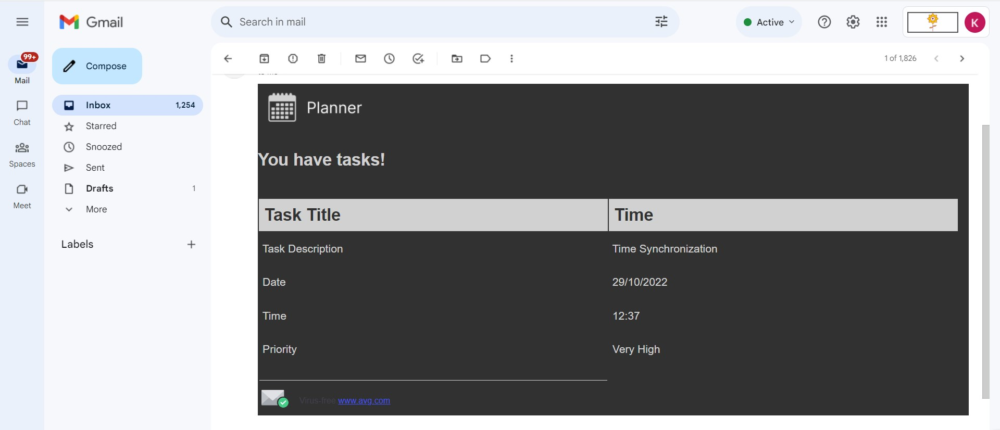

# Task Reminder Email Generator

This Python script sends task reminder emails using the Gmail SMTP server. It generates HTML-formatted email content with task details and sends it to the specified recipient's email address. It is a customized email sender which is the part of the bigger project of GUI Planner which is not publicly available.

## Prerequisites

Before running the script, make sure you have the following:

- Python 3.x installed.
- The `smtplib` library (included in Python's standard library).
- The `email` library (included in Python's standard library).
- A `credentials.py` file containing your Gmail email address and app password. Example:

```python
accDetails = {
    "EMAILID": "your_email@gmail.com",
    "APPPASSWORD": "your_app_password"
}
```

## Usage

1. Clone this repository or copy the script to your project directory.
2. Create a `credentials.py` file in the same directory with your Gmail email address and app password.
3. Ensure you have the necessary libraries available.
4. Customize the HTML template in the script to match your email content.
5. Run the script using the command: `python emailSender.py`.

## Features

- Sends task reminder emails to recipients using Gmail SMTP.
- Provides task details such as title, description, date, time, and priority.
- Uses HTML formatting to create visually appealing emails.

## Configuration

- Update the `accDetails` dictionary in the `credentials.py` file with your Gmail email and app password.
- Customize the HTML template within the `taskEmail` function to adjust the email content and styling.

## Screenshots




## Notes

- This script is provided for educational purposes and demonstrates sending emails using Python's built-in libraries. It is not a complete email solution and may require further customization and security enhancements for production use.
- Be cautious while using app passwords and ensure you follow Gmail's security guidelines.

## License

This project is licensed under the [MIT License](LICENSE).

---

**Disclaimer:** This script uses Gmail's SMTP server for sending emails. Make sure you understand and comply with Gmail's terms of use and security guidelines.
